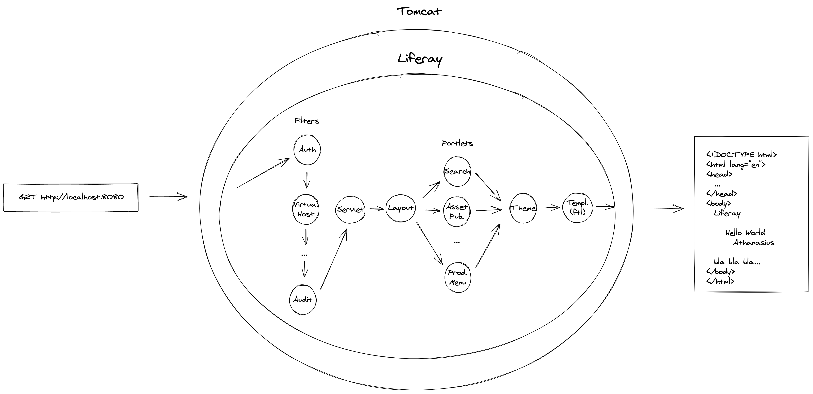

# LifeRequest



1. User types http://localhost:8080.
2. Browser sends HTTP GET http://localhost:8080.
3. Tomcat receives the request.
4. Resolves the application (ROOT).
5. R - Dispatches a request to Liferay.
6. Calls the Invoker Filter REQUEST.
7. [Calls the VirtualHost](https://github.com/liferay/liferay-portal/blob/b3173da81b62430f7150b695d5e944b224279580/portal-kernel/src/com/liferay/portal/kernel/servlet/filters/invoker/InvokerFilter.java#L104-L103) filter that [figures out the Group (Site)](https://github.com/liferay/liferay-portal/blob/10b15c6012d4386698a7c620094336e8f815c52a/portal-impl/src/com/liferay/portal/servlet/filters/virtualhost/VirtualHostFilter.java#L307).
8. R - [Generates a new request](https://github.com/liferay/liferay-portal/blob/10b15c6012d4386698a7c620094336e8f815c52a/portal-impl/src/com/liferay/portal/servlet/filters/virtualhost/VirtualHostFilter.java#L361) to the site's friendly URL (/web/guest) that follows the same path.
9. This new request is handled by the Friendly URL Servlet:
    ```xml
    <servlet-mapping>
      <servlet-name>Friendly URL Servlet - Public</servlet-name>
      <url-pattern>/web/*</url-pattern>    
    </servlet-mapping>
    ```
    [web.xml#L330-L333](https://github.com/liferay/liferay-portal/blob/e7b103201e9766843a15026af463a36caa13942f/portal-web/docroot/WEB-INF/web.xml#L330-L333)
10. R - It redirects to the main layout and [triggers another request](https://github.com/liferay/liferay-portal/blob/64cb899b4862bde519242ab49c1c0e44950c9859/modules/apps/friendly-url/friendly-url-service/src/main/java/com/liferay/friendly/url/internal/servlet/FriendlyURLServlet.java#L463): `/c/portal/layout?p_l_id=4&p_v_l_s_g_id=0`.
11. This new request is handled by the Main Servlet:
    ```xml
    <servlet-mapping>
      <servlet-name>Main Servlet</servlet-name>
      <url-pattern>/c/*</url-pattern>    
    </servlet-mapping>
    ```
    [web.xml#L302-L305](https://github.com/liferay/liferay-portal/blob/e7b103201e9766843a15026af463a36caa13942f/portal-web/docroot/WEB-INF/web.xml#L302-L305)
12. And it is delegated to the PortalRequestProcessor [MainServlet.java#L204](https://github.com/liferay/liferay-portal/blob/2c4ba62dc9ac386e21f6cfbbc7dc477a6aaeff3c/portal-impl/src/com/liferay/portal/internal/servlet/MainServlet.java#L204).
13. The request is mapped to a LayoutAction [PortalRequestProcessor.java#L414](https://github.com/liferay/liferay-portal/blob/151cb216a91f39463fdf3b2d8c61b8f5197f139a/portal-impl/src/com/liferay/portal/struts/PortalRequestProcessor.java#L414).
14. The action calls layout.includeLayoutContent [LayoutAction.java#L413](https://github.com/liferay/liferay-portal/blob/57c97dc78576222263e1cdfefb04070329f8b40e/portal-impl/src/com/liferay/portal/action/LayoutAction.java#L413).
15. The layout is a content layout therefore the ContentLayoutTypeController handles the rendering [modules/apps/layout/layout-type-controller/layout-type-controller-content/src/main/resources/META-INF/resources/layout/edit_layout/content.jsp](https://github.com/liferay/liferay-portal/blob/416a2473fe7d0ecbf40a2ed07d1aba6e290aeda5/modules/apps/layout/layout-type-controller/layout-type-controller-content/src/main/resources/META-INF/resources/layout/edit_layout/content.jsp).
16. The rendered result is stored in request[LAYOUT_CONTENT] [ContentLayoutTypeController.java#L207](https://github.com/liferay/liferay-portal/blob/be1746fe67dd1538c854b4d0c8e6ac0a1e27b3ad/modules/apps/layout/layout-type-controller/layout-type-controller-content/src/main/java/com/liferay/layout/type/controller/content/internal/layout/type/controller/ContentLayoutTypeController.java#L207).
17. The request [is forwarded](https://github.com/liferay/liferay-portal/blob/151cb216a91f39463fdf3b2d8c61b8f5197f139a/portal-impl/src/com/liferay/portal/struts/PortalRequestProcessor.java#L418) to [portal-web/docroot/html/common/themes/portal.jsp](https://github.com/liferay/liferay-portal/blob/db99e4210d9112585d5a2b973cb316413da0d053/portal-web/docroot/html/common/themes/portal.jsp).
18. This jsp uses the theme taglib that retrieves the theme [and calls](https://github.com/liferay/liferay-portal/blob/db99e4210d9112585d5a2b973cb316413da0d053/portal-web/docroot/html/common/themes/portal.jsp#L49) the portal_normal.jsp template.
19. This ends up being rendered by the theme's [portal_normal.ftl](https://github.com/liferay/liferay-portal/blob/32a0c101165afb8d8cc7a68713a208da96ad88a0/modules/apps/frontend-theme/frontend-theme-classic/src/templates/portal_normal.ftl).
20. That calls [portal-web/docroot/html/portal/layout.jsp](https://github.com/liferay/liferay-portal/blob/c37b07644cac803e48ece78e67a3915df01d52be/portal-web/docroot/html/portal/layout.jsp) which renders our layout inside the portal (tilesContent).

